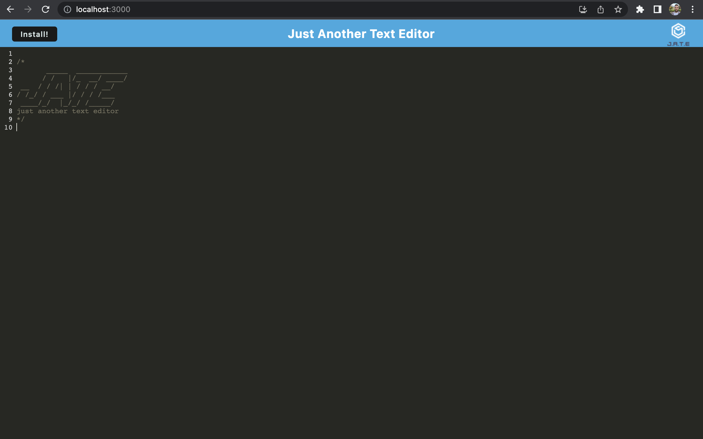

# PWA Text Editor 

### Description

A simple text editor that allows a user to create notes or snippets of code with  or without an internet connection. The notes can be retrieved at a later time. This app uses IndexedDB for data storage. The app is installable through the use of service workers.

- [Installation](#installation)
- [Usage](#usage)

### Installation

The application can be installed by clicking the install button on the home page or by clicking the install icon in the browser.

### Usage

This is a simple note taking application that stores a users notes for retreival at a later time

If you have any questions regarding this application, please email: trentanjurkans@gmail.com  

Below is a screenshot of the application:

##### The repository for this application can be found at: 

https://github.com/TRN10/PWA-text-editor

